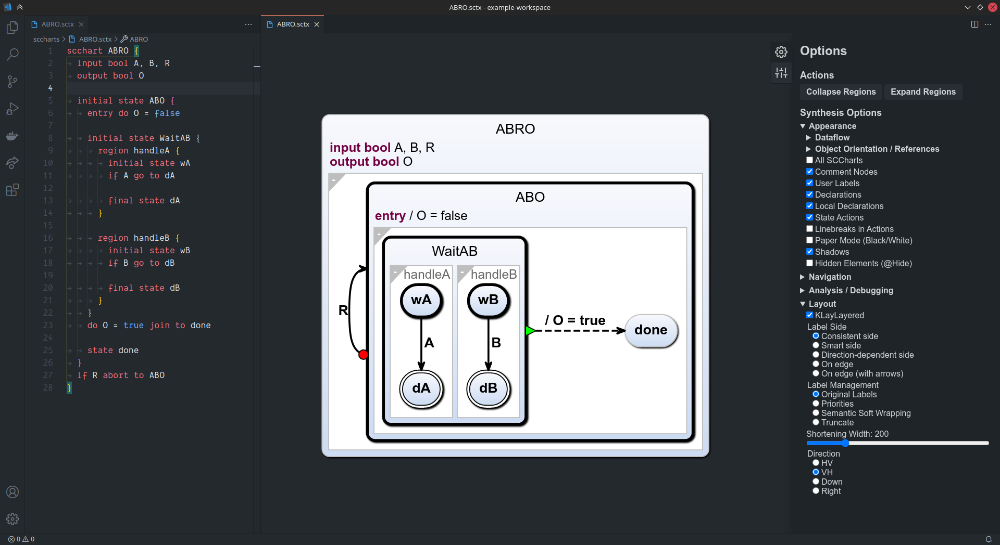

# KLighD Diagrams for Visual Studio Code

<figure style="text-align: center;">

<figcaption>Example of the KLighD diagram extension used to visualize a SCChart.</figcaption>
</figure>

## Features

This extension visualizes generated KLighD diagrams for other extensions. Some notable features are:

-   Open a diagram for a file in your language
-   Export diagrams as SVG
-   Interactively explore the visualized diagram

## Requirements

> **This extension is not intended to be used directly!**

Instead, it should be used as a dependency by other extensions to easily support diagram
visualization with KLighD. Your host extension is responsible for configuring a language client,
while the KLighD extension handles everything related to diagrams.

### Disclaimer

Developing a language server for your extension that uses [KLighD](https://github.com/kieler/KLighD)
to fulfill all requirements to be usable with this extension is no easy tasks. Until the distribution of
[KLighD](https://github.com/kieler/KLighD) and documentation about building your own language server
is improved, feel free to seek advise from a member of the KIELER working group.

An example for a simple language server with KLighD synthesis support can be found
[here](https://github.com/kieler/osgiviz/tree/master/plugins/de.cau.cs.kieler.osgiviz.language.server).
Configuration for the build process using Maven Tycho can be found
[here](https://github.com/kieler/osgiviz/tree/master/plugins/de.cau.cs.kieler.osgiviz.language.server).
The VS Code extension for this language server can be found
[here](https://github.com/kieler/osgiviz/tree/master/extension/osgiviz).

### Usage in your extension

1. Add an extension dependency to your extension's `package.json`.

```json
    "extensionDependencies": [
        "kieler.klighd-vscode"
    ],
```

2. Notify the KLighD extension about your language client.

```typescript
export async function activate(context: vscode.ExtensionContext) {
    // ... configuring the language client options

    const lsClient = new LanguageClient("Language Server", serverOptions, clientOptions);

    // Inform the KLighD extension about the LS client.
    // The first argument is your language client.
    // The second argument is an array of language file endings
    // that are supported by your LS client.
    // Returns an ID that is used to identify this extension when future
    // commands are sent to klighd-vscode.
    const refId = await vscode.commands.executeCommand(
        "klighd-vscode.setLanguageClient",
        lsClient,
        ["sctx"]
    );

    console.debug("Starting Language Server...");
    lsClient.start();
}
```

3. Configure extension contribution points to open a diagram view for your language.

```json
"contributes": {
    "menus": {
            "editor/title": [
                {
                    "when": "resourceLangId == sctx",
                    "command": "klighd-vscode.diagram.open",
                    "group": "navigation"
                }
            ],
            "editor/context": [
                {
                    "when": "resourceLangId == sctx",
                    "command": "klighd-vscode.diagram.open",
                    "group": "navigation"
                }
            ],
            "explorer/context": [
                {
                    "when": "resourceLangId == sctx",
                    "command": "klighd-vscode.diagram.open",
                    "group": "navigation"
                }
            ]
        }
}
```

### Intercepting messages

The KLighD diagram extension provides the option to intercept diagram actions that are about to be
sent to the language server. Each action has an identifier named `kind`.

To intercept an action, your extension has to provide an action handler with the following
signature:

```typescript
// Return `true` if the action should be forwarded to the language server. `false` otherwise.
type ActionHandler = (action: { kind: string }) => Promise<boolean>;
```

To register your action handler with the `klighd-vscode` extension call the following command:

```typescript
// - refId: your registration id returned from the setLanguageClient command
// - kind: the action kind that should be intercepted by the handler
// - handler: the action handler that is called for the provided action type.
vscode.commands.executeCommand("klighd-vscode.addActionHandler", refId: string, kind: string, handler: ActionHandler);
```

## Known Issues

-   Currently, only at most one extension that depends on `kieler.klighd-vscode` can be activated at
    the same time. This causes problems if a workspace opens multiple files that are handled by
    different KLighD dependent extensions. This issue is tracked [here](https://github.com/kieler/klighd-vscode/issues/6).
-   Exported SVG are currently not displayed properly. This issue is tracked
    [here](https://github.com/eclipse/sprotty/issues/149).
